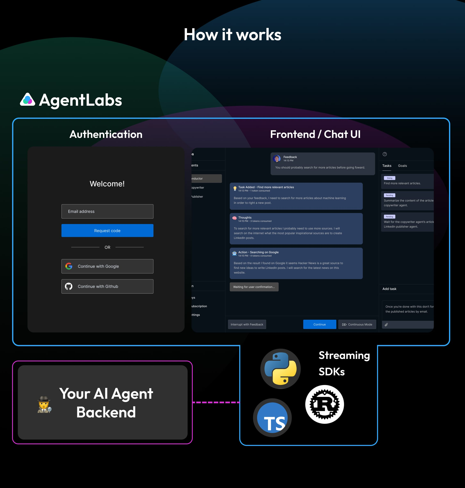
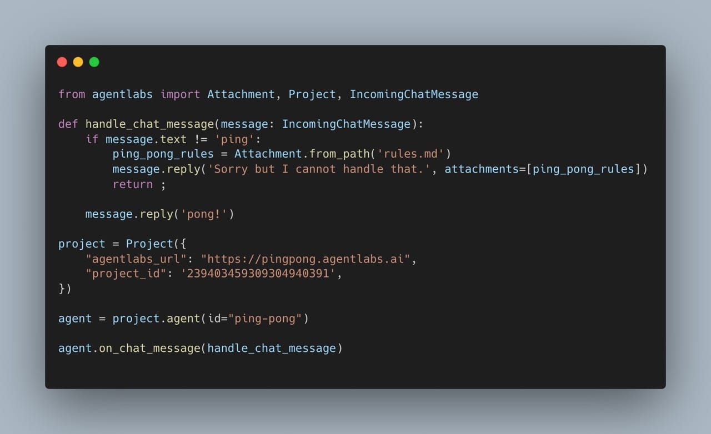

  

    <em>.</em>

Open-source universal frontend for your AI Agents that you can control with a realtime bidirectional streaming SDK from your backend.

AgentLabs allows you to ship your AI Agents to public users in a snap by providing an Authentication Portal, a neat Chat Frontend interface as well as the Analytics and Payment features you need.

Focus on your AI Agent backend, we handle the rest for you.

.

<h3 align="center">
🌟 Give us some love by starring this repository! 🌟  
</h3>

.

# AgentLabs - Open-Source Universal AI Agent Frontend

AgentLabs is <b>fully open-sourced (Apache 2.0)</b> and AgentLabs Inc. offers cloud hosting and dedicated enterprise grade support.

## How it works

  

## Getting Started

🌟 Try the **[Alpha Cloud Version](https://agentlabs.dev)** to get started quickly.

🌟 Check our **[Documentation](https://docs.agentlabs.dev)** to learn more about our SDK and find out how to get started with AgentLabs.

Note: more documentation about self-hosting will be added soon, although we recommend using the cloud version for now.

### Dead simple SDKs

  

## Alpha Release is Live!

The Alpha release is live! We're still actively developing the project so expect many things to change and improve.

| Component                | Status | Features                                                                                                                            |
|:-------------------------|:------:|-------------------------------------------------------------------------------------------------------------------------------------|
| Backoffice               |   ✅️   | <ul><li>Manage your projects</li><li>Configure basic auth methods for users</li><li>Manage agents</li><li>Manage your users</li></ul> |
| Agent UI                 |   ✅    | <ul><li>Authentication / Registration</li><li>Basic multi-agent support</li><li>Chat-based UI</li><li>Realtime request/response streaming</li></ul> |
| SDKs                     |   ✅    | <ul><li>Python Streaming backend SDK</li><li>Typescript Streaming backend SDK</li></ul>                                             |
| Cloud hosting            |   ✅️   | Basic support for cloud hosted version                                                                                              |
| Self hosting             |   ✅️   | Self hosted version with `docker-compose`.                                                                                          |
| Basic docs with examples |   ✅️   | Everything will be documented so you can get started either with the cloud version or the self hosted version.                      |

.

<h3 align="center">
🌟 Give us some love by starring this repository! 🌟  
</h3>

.

