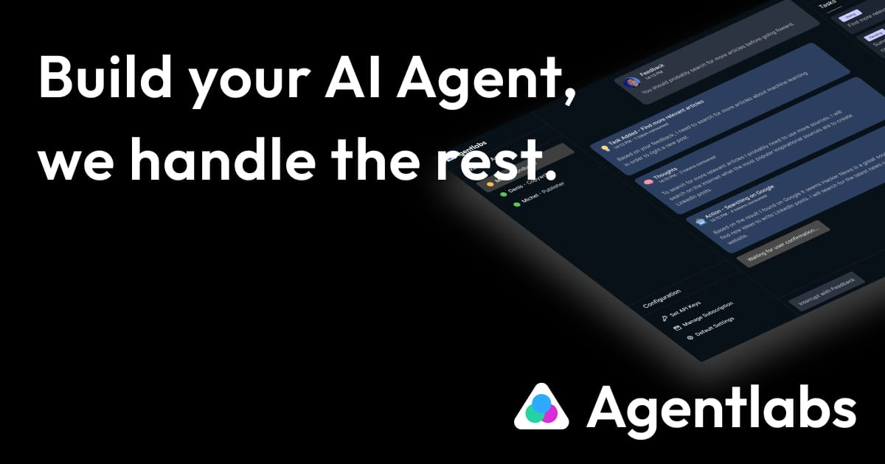

<p align="center">
  <a href="https://agentlabs.dev"></a>
</p>

<p align="center">
    <em>.</em>
</p>

<p align=center>
Open-source universal frontend for your AI Agents that you can control with a realtime bidirectional streaming SDK from your backend.
</p>

<p align="center">
AgentLabs allows you to ship your AI Agents to public users in a snap by providing an Authentication Portal, a neat Chat Frontend interface as well as the Analytics and Payment features you need.
</p>

<p align=center>
Focus on your AI Agent backend, we handle the rest for you.
</p>

<p align="center">
<a href="" target="_blank">
    
</a>
<a href="" target="_blank">
    
</a>
</p>

# AgentLabs - Open-Source Universal AI Agent Frontend

AgentLabs is <b>fully open-sourced (Apache 2.0)</b> and AgentLabs Inc. offers cloud hosting and dedicated enterprise grade support.


<p align="center">
  <a href="https://agentlabs.dev"></a>
</p>

## Important notice

This repository is under active development, a first stable release is planned for the next few weeks.

Subscribe to [agentlabs.dev](https://agentlabs.dev) to get notified when the first stable release is out!

<p align="center">
.
</p>

<h3 align="center">
🌟 Give us some love by starring this repository! 🌟  
</h3>

<p align="center">
.
</p>

## Getting started

### Configure environment

Copy env sample to a proper `.env` file:

```shell
cp .env.example .env
```

In the copied file fill the missing values or change defaults as needed.

### Development

```shell
docker compose -f docker-compose.dev.yml up --build -d
```

In development mode both the frontend and server folds will be bind-mounted inside their respective docker containers.
That means that any change made on the local filesystem will reload the running application.

For the svelte frontend, note that this can slow down things if you are not running Linux as the filesystem instructions have to be translated.
In case that's not manageable running the frontend separately and connecting it to the server manually is probably the best alternative.

### Production

```shell
docker compose up --build -d
```
